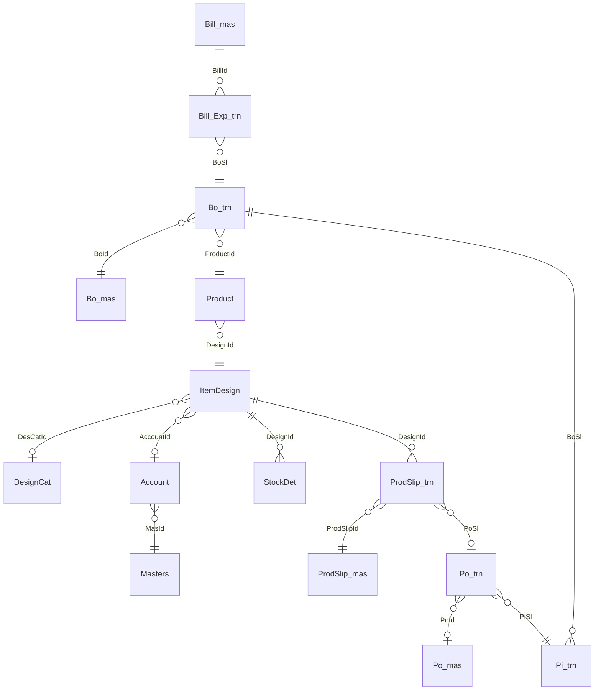
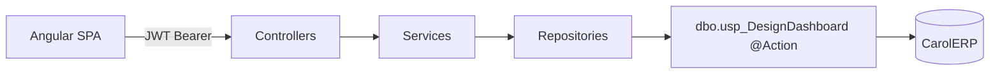
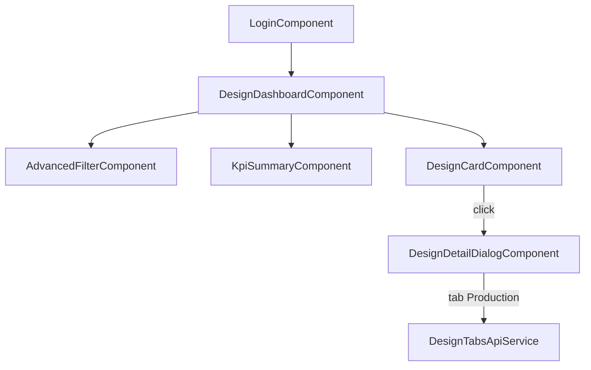
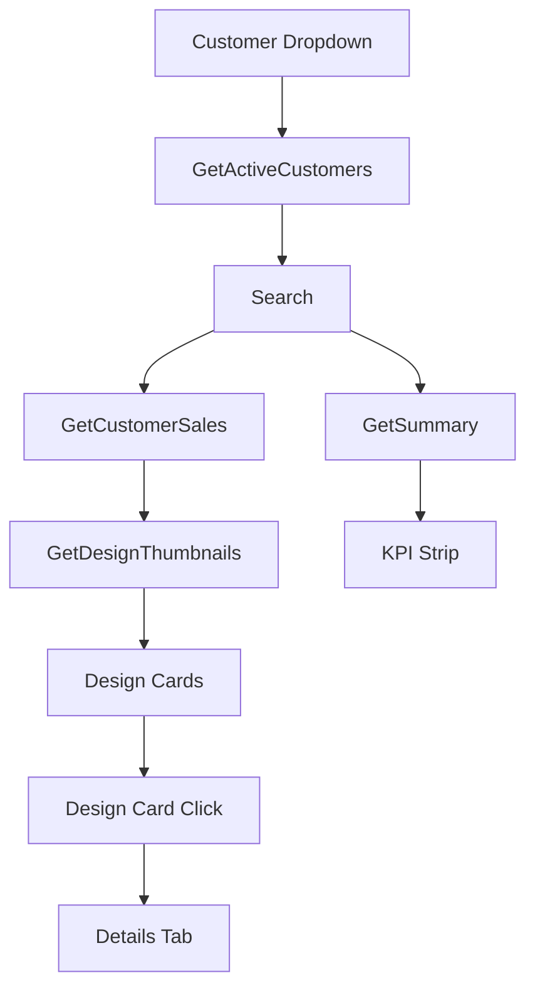
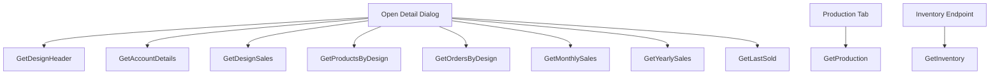

# Design Dashboard — Architecture Document

**Project:** Design Dashboard  
**Database:** CarolERP  
**Stored procedure:** `dbo.usp_DesignDashboard` (also referred to as `Usp_DesignDashboard`)  
**Deploy script:** `Database/usp_DesignDashboard.sql`  
**Stack:** Angular 19 + PrimeNG · ASP.NET Core (.NET 10) · ADO.NET · SQL Server  
**Auth:** JWT (no DB auth) — `POST /api/auth/login` (public); all other APIs require Bearer token  

---

## Project Overview

Design Dashboard is a **read-only enterprise analytics UI** for jewellery/design sales. Users:

1. Sign in with JWT  
2. Select **Customer** + **date range**  
3. View **KPI summary** and **product cards** (one card per `ProductId`)  
4. Open a **design detail dialog** (General, Sales, Orders, Production)

All business data flows through a **single stored procedure** dispatched by `@Action`.

```
Angular → Controller → Service → Repository → dbo.usp_DesignDashboard (@Action) → SQL Server
```

| Layer | Responsibility |
|--------|----------------|
| Database | `dbo.usp_DesignDashboard` action dispatcher |
| Repository | ADO.NET (`SqlCommand` / `SqlDataReader`) |
| Service | Validation, orchestration, logging |
| Controller | HTTP endpoints, JWT `[Authorize]` |
| Angular services | HTTP clients + mappers |
| Angular components | Filters, KPIs, cards, detail dialog |

---

## Database Layer

### Procedure signature

```sql
CREATE OR ALTER PROCEDURE dbo.usp_DesignDashboard
    @Action      NVARCHAR(50),
    @AccountId   INT = NULL,
    @DesignId    INT = NULL,
    @StartDate   DATETIME = NULL,
    @EndDate     DATETIME = NULL,
    @DesignIds   dbo.IntIdList READONLY
```

**Prerequisite TVP:** `dbo.IntIdList` (`Id INT PRIMARY KEY`) — used by `GetDesignThumbnails`.

### Total actions: **14**

| # | Action | Category |
|---|--------|----------|
| 1 | `GetActiveCustomers` | Dashboard |
| 2 | `GetCustomerSales` | Dashboard |
| 3 | `GetSummary` | Dashboard |
| 4 | `GetDesignThumbnails` | Dashboard (support) |
| 5 | `GetAccountDetails` | Details tab |
| 6 | `GetDesignHeader` | Details tab |
| 7 | `GetDesignSales` | Details tab |
| 8 | `GetProductsByDesign` | Details tab |
| 9 | `GetOrdersByDesign` | Details tab |
| 10 | `GetMonthlySales` | Details tab |
| 11 | `GetYearlySales` | Details tab |
| 12 | `GetLastSold` | Details tab |
| 13 | `GetProduction` | Production |
| 14 | `GetInventory` | Inventory |

### Action counts

| Category | Count | Actions |
|----------|------:|---------|
| Dashboard | **4** | GetActiveCustomers, GetCustomerSales, GetSummary, GetDesignThumbnails |
| Details tab | **8** | GetAccountDetails, GetDesignHeader, GetDesignSales, GetProductsByDesign, GetOrdersByDesign, GetMonthlySales, GetYearlySales, GetLastSold |
| Production | **1** | GetProduction |
| Inventory | **1** | GetInventory |
| **Total** | **14** | |

---

## Action catalogue (complete)

### 1. GetActiveCustomers

| Field | Detail |
|-------|--------|
| **Purpose** | Customer dropdown — active Customer (MasType 65) / Local Customer (MasType 95) accounts that have bills in the date range |
| **Inputs** | `@StartDate`, `@EndDate` (required) |
| **Outputs** | `AccountId`, `AccountName` |
| **Tables** | `Account`, `Masters`, `Bill_mas` |
| **Joins** | `Account INNER JOIN Masters`; `EXISTS` on `Bill_mas` |
| **Query flow** | Filter active accounts by MasType → must have at least one bill in range → distinct list ordered by name |
| **API** | `GET /api/customer?startDate&endDate` |
| **Repository** | `CustomerRepository.GetActiveCustomersAsync` |
| **Service** | `CustomerService.GetActiveCustomersAsync` |
| **Controller** | `CustomerController.GetCustomers` |
| **Angular service** | `CustomerApiService.getCustomers` |
| **Component** | `DesignDashboardComponent.loadCustomers` |
| **UI** | Advanced filter — Customer select |

---

### 2. GetCustomerSales

| Field | Detail |
|-------|--------|
| **Purpose** | Dashboard product cards — **one row per ProductId** (DesignId/Code may repeat) |
| **Inputs** | `@AccountId`, `@StartDate`, `@EndDate` (required) |
| **Outputs** | `DesignId`, `DesignCode`, `DesignName`, `ProductId`, `ProductName`, `TotalSalesQty`, `TotalSalesAmount`, `PendingOrder`, `PendingProcess` |
| **Tables** | `Bill_mas`, `Bill_Exp_trn`, `Bo_trn`, `Product`, `ItemDesign`, `Po_trn`, `Pi_trn` |
| **Joins** | Bill chain → Product → ItemDesign; CTEs for sales / BO lines / pending order / pending process |
| **Query flow** | `ProductSales` CTE → `ProductBoSl` → `ProductOrderAgg` + `ProductProcess` → left-join aggregate → one row/product |
| **API** | `GET /api/customer-sales?accountId&startDate&endDate` |
| **Repository** | `CustomerSalesRepository.GetCustomerSalesAsync` (+ `DesignThumbnailLoader`) |
| **Service** | `CustomerSalesService.GetCustomerSalesAsync` |
| **Controller** | `CustomerSalesController.GetCustomerSales` |
| **Angular service** | `CustomerSalesApiService.getCustomerSales` → `mapCustomerSalesToListItem` |
| **Component** | `DesignDashboardComponent.fetchDesigns` |
| **UI** | Product card grid (`app-design-card`) |

---

### 3. GetSummary

| Field | Detail |
|-------|--------|
| **Purpose** | KPI source rows — same grain as cards (one row per ProductId); C# aggregates 9 KPI metrics |
| **Inputs** | `@AccountId`, `@StartDate`, `@EndDate` (required) |
| **Outputs** | `DesignId`, `DesignCode`, `DesignName`, `ProductId`, `ProductName`, `TotalSalesQty`, `TotalSalesAmount`, `PendingOrder`, `PendingProcess`, `TotalOrderQty`, `TotalOrderAmount`, `PendingOrderValue`, `CompletedOrderQty` |
| **Tables** | Same sales chain as GetCustomerSales + `Po_trn` / `Pi_trn` |
| **Joins** | Same CTE pattern as GetCustomerSales with extra order aggregates |
| **Query flow** | Product sales + order/process CTEs → product rows → `DashboardRepository` sums / distinct counts |
| **API** | `GET /api/dashboard/summary?accountId&startDate&endDate` |
| **Repository** | `DashboardRepository.GetSummaryAsync` |
| **Service** | `DashboardService.GetSummaryAsync` |
| **Controller** | `DashboardController.GetSummary` |
| **Angular service** | `DashboardApiService.getSummary` → `mapDashboardSummary` |
| **Component** | `DesignDashboardComponent.fetchKpis` |
| **UI** | KPI strip (`app-kpi-summary`) |

---

### 4. GetDesignThumbnails

| Field | Detail |
|-------|--------|
| **Purpose** | Batch-load design card thumbnails after sales rows return |
| **Inputs** | `@DesignIds` (`dbo.IntIdList` TVP) |
| **Outputs** | `DesignId`, `ImgThumbData` |
| **Tables** | `ItemDesign` |
| **Joins** | `ItemDesign INNER JOIN @DesignIds` |
| **Query flow** | Filter designs in TVP with non-null thumb blob |
| **API** | *(internal — no dedicated HTTP route; called from sales repository)* |
| **Repository** | `DesignThumbnailLoader.LoadAsync` / used by `CustomerSalesRepository` |
| **Service** | *(via CustomerSalesService path)* |
| **Controller** | *(via CustomerSalesController)* |
| **Angular service** | *(embedded in customer-sales DTO as `imageThumbnail`)* |
| **Component** | `DesignCardComponent` image header |
| **UI** | Card thumbnail |

---

### 5. GetAccountDetails

| Field | Detail |
|-------|--------|
| **Purpose** | Customer account block for design detail |
| **Inputs** | `@AccountId` (required) |
| **Outputs** | `AccountId`, `AccountName`, `AccountCode`, `Address`, `Email`, `TelNo`, `GstNo` |
| **Tables** | `Account` |
| **Joins** | None |
| **Query flow** | Select account by id |
| **API** | Part of `GET /api/design/{designId}` (parallel call) |
| **Repository** | `DesignRepository.QueryAccountDetailsAsync` |
| **Service** | `DesignService.GetDesignByIdAsync` |
| **Controller** | `DesignController.GetDesignById` |
| **Angular service** | `DesignApiService.getDesignById` |
| **Component** | `DesignDetailDialogComponent.ngOnInit` |
| **UI** | Detail dialog (account context / customer name) |

---

### 6. GetDesignHeader

| Field | Detail |
|-------|--------|
| **Purpose** | Design header + general info (product, category, material, stock) |
| **Inputs** | `@DesignId` (required) |
| **Outputs** | `DesignId`, `DesignCode`, `DesignName`, `ImgThumbData`, `AccountId`, `ProductName`, `ProductCategory`, `Material`, `NetWeight`, `Status`, `CurrentQuantity` |
| **Tables** | `ItemDesign`, `DesignCat`, `Product`, `StockDet` |
| **Joins** | `LEFT JOIN DesignCat`; `OUTER APPLY` top product; subquery on `StockDet` |
| **Query flow** | Load design → category → primary product → stock sum (Rec − Iss) |
| **API** | Part of `GET /api/design/{designId}` |
| **Repository** | `DesignRepository.QueryDesignHeaderAsync` |
| **Service** | `DesignService.GetDesignByIdAsync` |
| **Controller** | `DesignController.GetDesignById` |
| **Angular service** | `DesignApiService.getDesignById` → `mapDesignDetail` |
| **Component** | `DesignDetailDialogComponent` — General Information tab |
| **UI** | Detail dialog header + General tab |

---

### 7. GetDesignSales

| Field | Detail |
|-------|--------|
| **Purpose** | Sales totals for one design (optional account/date filter) |
| **Inputs** | `@DesignId` (required); `@AccountId`, `@StartDate`, `@EndDate` (optional) |
| **Outputs** | `DesignId`, `DesignCode`, `DesignName`, `TotalSalesQty`, `TotalSalesAmount`, `PendingOrder`, `PendingProcess` |
| **Tables** | `Bill_mas`, `Bill_Exp_trn`, `Bo_trn`, `Product`, `ItemDesign` |
| **Joins** | Standard bill → BO → product → design chain |
| **Query flow** | Filter by design (+ optional filters) → sum qty/amount |
| **API** | Part of `GET /api/design/{designId}` |
| **Repository** | `DesignRepository.QueryCustomerSalesByDesignIdAsync` |
| **Service** | `DesignService.GetDesignByIdAsync` |
| **Controller** | `DesignController.GetDesignById` |
| **Angular service** | `DesignApiService.getDesignById` |
| **Component** | Detail — Sales Summary KPIs |
| **UI** | Sales tab totals |

---

### 8. GetProductsByDesign

| Field | Detail |
|-------|--------|
| **Purpose** | Product list under a design (composition, net wt, active) |
| **Inputs** | `@DesignId` (required) |
| **Outputs** | `ProductId`, `ProductName`, `BarCode`, `NetWt`, `Composition`, `Active` |
| **Tables** | `Product` |
| **Joins** | None |
| **Query flow** | All products for design, ordered by name |
| **API** | Part of `GET /api/design/{designId}` |
| **Repository** | `DesignRepository.QueryProductsAsync` |
| **Service** | `DesignService.GetDesignByIdAsync` |
| **Controller** | `DesignController.GetDesignById` |
| **Angular service** | `DesignApiService.getDesignById` |
| **Component** | Detail — General (aligned with header) |
| **UI** | Product / material fields |

---

### 9. GetOrdersByDesign

| Field | Detail |
|-------|--------|
| **Purpose** | Order lines for design detail Orders grid |
| **Inputs** | `@DesignId` (required); `@AccountId`, `@StartDate`, `@EndDate` (optional) |
| **Outputs** | `OrderNo`, `Customer`, `OrderDate`, `Quantity`, `Amount` |
| **Tables** | `Bill_mas`, `Bill_Exp_trn`, `Bo_trn`, `Bo_mas`, `Product`, `Account` |
| **Joins** | Bill chain + `Bo_mas`; `LEFT JOIN Account` |
| **Query flow** | Orders for design products, newest bill date first |
| **API** | Part of `GET /api/design/{designId}` |
| **Repository** | `DesignRepository.QueryOrdersAsync` |
| **Service** | `DesignService.GetDesignByIdAsync` |
| **Controller** | `DesignController.GetDesignById` |
| **Angular service** | `DesignApiService.getDesignById` |
| **Component** | Detail — Order Details tab |
| **UI** | Orders table |

---

### 10. GetMonthlySales

| Field | Detail |
|-------|--------|
| **Purpose** | Monthly sales trend for charts |
| **Inputs** | `@DesignId` (required); optional account/dates |
| **Outputs** | `Label` (yyyy-MM), `Quantity`, `Value` |
| **Tables** | `Bill_mas`, `Bill_Exp_trn`, `Bo_trn`, `Product` |
| **Joins** | Bill → BO → Product |
| **Query flow** | Group by month label |
| **API** | Part of `GET /api/design/{designId}` |
| **Repository** | `DesignRepository.QueryMonthlySalesAsync` |
| **Service** | `DesignService.GetDesignByIdAsync` |
| **Controller** | `DesignController.GetDesignById` |
| **Angular service** | `DesignApiService.getDesignById` |
| **Component** | `DesignDetailDialogComponent.monthlyChart` |
| **UI** | Sales tab — monthly chart |

---

### 11. GetYearlySales

| Field | Detail |
|-------|--------|
| **Purpose** | Yearly sales trend for charts |
| **Inputs** | `@DesignId` (required); optional account/dates |
| **Outputs** | `Label` (year), `Quantity`, `Value` |
| **Tables** | `Bill_mas`, `Bill_Exp_trn`, `Bo_trn`, `Product` |
| **Joins** | Bill → BO → Product |
| **Query flow** | Group by year |
| **API** | Part of `GET /api/design/{designId}` |
| **Repository** | `DesignRepository.QueryYearlySalesAsync` |
| **Service** | `DesignService.GetDesignByIdAsync` |
| **Controller** | `DesignController.GetDesignById` |
| **Angular service** | `DesignApiService.getDesignById` |
| **Component** | `DesignDetailDialogComponent.yearlyChart` |
| **UI** | Sales tab — yearly chart |

---

### 12. GetLastSold

| Field | Detail |
|-------|--------|
| **Purpose** | Most recent bill date for the design |
| **Inputs** | `@DesignId` (required); optional account/dates |
| **Outputs** | `LastSoldDate` |
| **Tables** | `Bill_mas`, `Bill_Exp_trn`, `Bo_trn`, `Product` |
| **Joins** | Bill → BO → Product |
| **Query flow** | `MAX(BillDate)` |
| **API** | Part of `GET /api/design/{designId}` |
| **Repository** | `DesignRepository.QueryLastSoldDateAsync` |
| **Service** | `DesignService.GetDesignByIdAsync` |
| **Controller** | `DesignController.GetDesignById` |
| **Angular service** | `DesignApiService.getDesignById` |
| **Component** | Detail — Sales Summary “Last Sold Date” |
| **UI** | Sales tab mini-KPI |

---

### 13. GetProduction

| Field | Detail |
|-------|--------|
| **Purpose** | Production grid — always ≥ 1 row (default zeros / `-` when empty) |
| **Inputs** | `@DesignId` (required) |
| **Outputs** | `ProductionDate`, `Location`, `ProducedQuantity`, `RequiredQuantity` |
| **Tables** | `ProdSlip_trn`, `ProdSlip_mas`, `Po_trn`, `Po_mas`, `Account` |
| **Joins** | `INNER JOIN ProdSlip_mas`; `LEFT JOIN Po_trn/Po_mas/Account` |
| **Query flow** | If no slips → default row; else slip lines with location + qty |
| **API** | `GET /api/designs/{designId}/production` *(lazy — on Production tab open)* |
| **Repository** | `DesignRepository.GetProductionByDesignIdAsync` / `QueryProductionAsync` |
| **Service** | `DesignService.GetProductionByDesignIdAsync` |
| **Controller** | `DesignTabsController.GetProduction` |
| **Angular service** | `DesignTabsApiService.getProduction` |
| **Component** | `DesignDetailDialogComponent.loadProductionOnce` |
| **UI** | Production tab |

---

### 14. GetInventory

| Field | Detail |
|-------|--------|
| **Purpose** | Current stock = `SUM(RecQty − IssQty)` |
| **Inputs** | `@DesignId` (required) |
| **Outputs** | `CurrentStock` |
| **Tables** | `StockDet` |
| **Joins** | None |
| **Query flow** | Aggregate stock movements for design |
| **API** | `GET /api/designs/{designId}/inventory` *(also stock mirrored from header in detail DTO)* |
| **Repository** | `DesignRepository.GetInventoryByDesignIdAsync` |
| **Service** | `DesignService.GetInventoryByDesignIdAsync` |
| **Controller** | `DesignTabsController.GetInventory` |
| **Angular service** | `DesignTabsApiService.getInventory` |
| **Component** | Detail — Current Quantity (primarily from header); inventory endpoint available |
| **UI** | General Information — Current Quantity |

---

## Repository Layer

| Repository | File | SP actions used |
|------------|------|-----------------|
| `CustomerRepository` | `Repositories/CustomerRepository.cs` | GetActiveCustomers |
| `CustomerSalesRepository` | `Repositories/CustomerSalesRepository.cs` | GetCustomerSales (+ thumbnails helper) |
| `DashboardRepository` | `Repositories/DashboardRepository.cs` | GetSummary |
| `DesignRepository` | `Repositories/DesignRepository.cs` | GetDesignHeader, GetDesignSales, GetProductsByDesign, GetOrdersByDesign, GetMonthlySales, GetYearlySales, GetLastSold, GetAccountDetails, GetProduction, GetInventory |
| `DesignThumbnailLoader` | `Helpers/DesignThumbnailLoader.cs` | GetDesignThumbnails |

**Helper:** `DesignDashboardSp` builds `SqlCommand` for `dbo.usp_DesignDashboard` with `@Action` and optional parameters.

---

## Service Layer

| Service | Methods |
|---------|---------|
| `CustomerService` | `GetActiveCustomersAsync` |
| `CustomerSalesService` | `GetCustomerSalesAsync` |
| `DashboardService` | `GetSummaryAsync` |
| `DesignService` | `GetDesignByIdAsync`, `GetProductionByDesignIdAsync`, `GetInventoryByDesignIdAsync` |
| `AuthService` / `JwtService` | Login + JWT issue *(not SP-related)* |

---

## Controller Layer

| Controller | Route | Actions |
|------------|-------|---------|
| `AuthController` | `/api/auth` | `POST login` `[AllowAnonymous]` |
| `CustomerController` | `/api/customer` | `GET` |
| `CustomerSalesController` | `/api/customer-sales` | `GET` |
| `DashboardController` | `/api/dashboard` | `GET summary` |
| `DesignController` | `/api/design` | `GET {designId}` |
| `DesignTabsController` | `/api/designs/{designId}` | `GET production`, `GET inventory` |

All business controllers: `[Authorize]` (JWT).

---

## Angular Service Layer

| Angular service | Methods | Backend |
|-----------------|---------|---------|
| `AuthService` | `login`, `logout`, `isLoggedIn`, `getToken` | `/api/auth/login` |
| `CustomerApiService` | `getCustomers` | `/api/customer` |
| `CustomerSalesApiService` | `getCustomerSales` | `/api/customer-sales` |
| `DashboardApiService` | `getSummary` | `/api/dashboard/summary` |
| `DesignApiService` | `getDesignById` | `/api/design/{id}` |
| `DesignTabsApiService` | `getProduction`, `getInventory` | `/api/designs/{id}/production\|inventory` |

**Mappers:** `design-api.mapper.ts` — `mapCustomersToOptions`, `mapCustomerSalesToListItem`, `mapDashboardSummary`, `mapDesignDetail`.

---

## Angular Component Layer

| Component | Role |
|-----------|------|
| `LoginComponent` | JWT login UI |
| `DesignDashboardComponent` | Filters, Search/Refresh, KPIs, card grid, user menu |
| `AdvancedFilterComponent` | Customer + date filters |
| `KpiSummaryComponent` | 9 KPI tiles |
| `DesignCardComponent` | Product card KPIs |
| `DesignDetailDialogComponent` | Tabs: General, Sales, Orders, Production |

---

## UI Flow

```
Login (/login)
    ↓ JWT
Dashboard (/dashboard)
    ↓ Select Customer + Dates → Search
Customer Dropdown  →  GetActiveCustomers
    ↓
Product Cards      →  GetCustomerSales (+ GetDesignThumbnails)
KPI Strip          →  GetSummary
    ↓ Card click / View Details
Design Detail Dialog
    ↓ Parallel on open
GetDesignHeader + GetDesignSales + GetProductsByDesign
+ GetOrdersByDesign + GetMonthlySales + GetYearlySales
+ GetLastSold + GetAccountDetails
    ↓ Open Production tab
GetProduction
```

### Details Tab mapping

| Tab / area | SP actions |
|------------|------------|
| Header / customer | GetAccountDetails, GetDesignHeader |
| General Information | GetDesignHeader, GetProductsByDesign, stock via header/`GetInventory` |
| Sales Summary | GetDesignSales, GetLastSold, GetMonthlySales, GetYearlySales |
| Order Details | GetOrdersByDesign |
| Production | GetProduction *(lazy)* |
| Inventory | GetInventory *(endpoint available; header uses CurrentQuantity)* |

---

## Query Flow (core sales chain)

```
Bill_mas
   ↓ BillId
Bill_Exp_trn
   ↓ BoSl
Bo_trn
   ↓ ProductId
Product
   ↓ DesignId
ItemDesign
```

**Pending process path:** `Bo_trn.BoSl` → `Pi_trn` → `Po_trn`  
**Production path:** `ProdSlip_trn` → `ProdSlip_mas` → `Po_trn` / `Po_mas` → `Account` (location)  
**Stock path:** `StockDet` (RecQty − IssQty)

---

## Function Mapping Table

| Action Name | Repository Method | Service Method | Controller Action | Angular Function | Component |
|-------------|-------------------|----------------|-------------------|------------------|-----------|
| GetActiveCustomers | `CustomerRepository.GetActiveCustomersAsync` | `CustomerService.GetActiveCustomersAsync` | `CustomerController.GetCustomers` | `CustomerApiService.getCustomers` | `DesignDashboardComponent.loadCustomers` |
| GetCustomerSales | `CustomerSalesRepository.GetCustomerSalesAsync` | `CustomerSalesService.GetCustomerSalesAsync` | `CustomerSalesController.GetCustomerSales` | `CustomerSalesApiService.getCustomerSales` | `DesignDashboardComponent.fetchDesigns` |
| GetSummary | `DashboardRepository.GetSummaryAsync` | `DashboardService.GetSummaryAsync` | `DashboardController.GetSummary` | `DashboardApiService.getSummary` | `DesignDashboardComponent.fetchKpis` |
| GetDesignThumbnails | `DesignThumbnailLoader.LoadAsync` | *(via sales service)* | *(via sales controller)* | *(DTO imageThumbnail)* | `DesignCardComponent` |
| GetAccountDetails | `DesignRepository.QueryAccountDetailsAsync` | `DesignService.GetDesignByIdAsync` | `DesignController.GetDesignById` | `DesignApiService.getDesignById` | `DesignDetailDialogComponent.ngOnInit` |
| GetDesignHeader | `DesignRepository.QueryDesignHeaderAsync` | `DesignService.GetDesignByIdAsync` | `DesignController.GetDesignById` | `DesignApiService.getDesignById` | `DesignDetailDialogComponent` (General) |
| GetDesignSales | `DesignRepository.QueryCustomerSalesByDesignIdAsync` | `DesignService.GetDesignByIdAsync` | `DesignController.GetDesignById` | `DesignApiService.getDesignById` | Detail Sales KPIs |
| GetProductsByDesign | `DesignRepository.QueryProductsAsync` | `DesignService.GetDesignByIdAsync` | `DesignController.GetDesignById` | `DesignApiService.getDesignById` | Detail General |
| GetOrdersByDesign | `DesignRepository.QueryOrdersAsync` | `DesignService.GetDesignByIdAsync` | `DesignController.GetDesignById` | `DesignApiService.getDesignById` | Detail Orders tab |
| GetMonthlySales | `DesignRepository.QueryMonthlySalesAsync` | `DesignService.GetDesignByIdAsync` | `DesignController.GetDesignById` | `DesignApiService.getDesignById` | `monthlyChart()` |
| GetYearlySales | `DesignRepository.QueryYearlySalesAsync` | `DesignService.GetDesignByIdAsync` | `DesignController.GetDesignById` | `DesignApiService.getDesignById` | `yearlyChart()` |
| GetLastSold | `DesignRepository.QueryLastSoldDateAsync` | `DesignService.GetDesignByIdAsync` | `DesignController.GetDesignById` | `DesignApiService.getDesignById` | Sales Last Sold |
| GetProduction | `DesignRepository.GetProductionByDesignIdAsync` | `DesignService.GetProductionByDesignIdAsync` | `DesignTabsController.GetProduction` | `DesignTabsApiService.getProduction` | `loadProductionOnce()` |
| GetInventory | `DesignRepository.GetInventoryByDesignIdAsync` | `DesignService.GetInventoryByDesignIdAsync` | `DesignTabsController.GetInventory` | `DesignTabsApiService.getInventory` | Inventory / Current Qty |

---

## SQL Table Relationships

```
Bill_mas
   │ BillId
   ▼
Bill_Exp_trn
   │ BoSl
   ▼
Bo_trn ──────────────► Bo_mas (orders)
   │ ProductId
   ▼
Product
   │ DesignId
   ▼
ItemDesign ── DesCatId ──► DesignCat
   │
   ├── AccountId ──► Account ── MasId ──► Masters
   │
   └── DesignId ──► StockDet
                 └── ProdSlip_trn ──► ProdSlip_mas
                              └── PoSl ──► Po_trn ──► Po_mas
                              └── Pi_trn (via BoSl for pending process)
```

### Additional tables

| Table | Role |
|-------|------|
| `Account` | Customers / locations |
| `Masters` | Account type (MasType 65/95) |
| `StockDet` | Inventory movements |
| `ProdSlip_trn` / `ProdSlip_mas` | Production slips |
| `Po_trn` / `Po_mas` | Purchase/production orders |
| `Pi_trn` | Process instructions linked to BO |
| `DesignCat` | Design category |
| `Bo_mas` | Business order header |

---

## Mermaid Diagrams

### Database relationships



### API flow



### Angular component flow



### Dashboard flow



### Details tab flow



---

## Total Counts

| Metric | Count |
|--------|------:|
| SP actions (total) | **14** |
| Dashboard actions | **4** |
| Details tab actions | **8** |
| Production actions | **1** |
| Inventory actions | **1** |
| HTTP business APIs (excl. auth) | **6** route groups |
| Angular feature services (data) | **5** |
| Primary UI screens | Login, Dashboard, Detail dialog |

---

## Ports & hosting

| URL | Role |
|-----|------|
| `http://localhost:100` | API + hosted SPA |
| `http://localhost:5000` | API + hosted SPA (dual bind) |
| `http://localhost:4200` | `ng serve` with proxy `/api` → `:5000` |

After Angular UI changes: `npm run build:wwwroot` then restart API.

---

*Generated from repository analysis of `Database/usp_DesignDashboard.sql`, `DesignDashboard.Api`, and `src/app`.*
